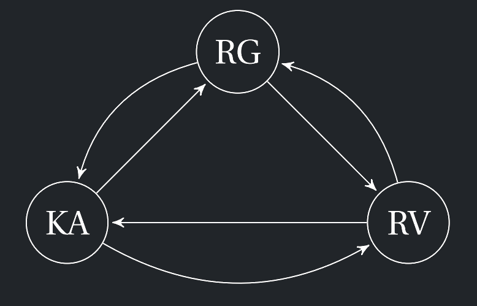

# 2.4 Převody mezi RG, RV a KA

Tato kapitola shrnuje algoritmické postupy pro převody mezi regulárními gramatikami (RG), regulárními výrazy (RV) a konečnými automaty (KA).

{ align=center width="50%" }
